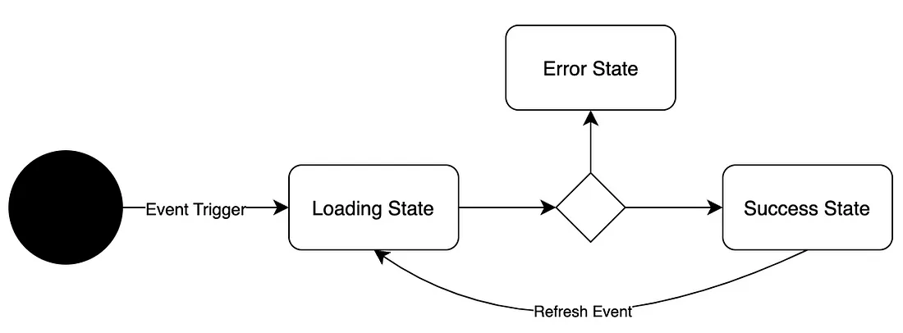
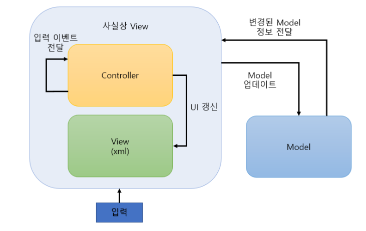
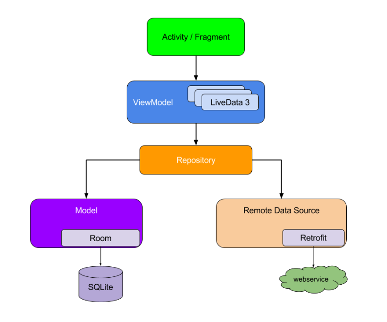
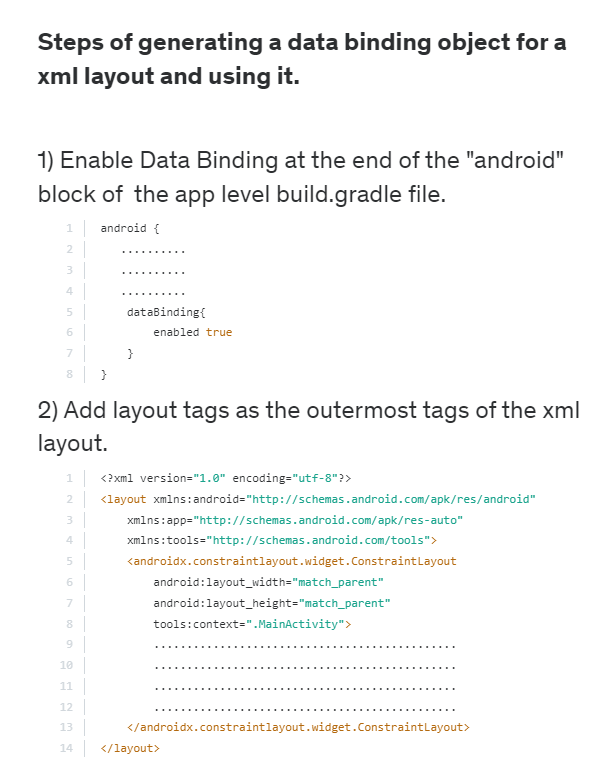
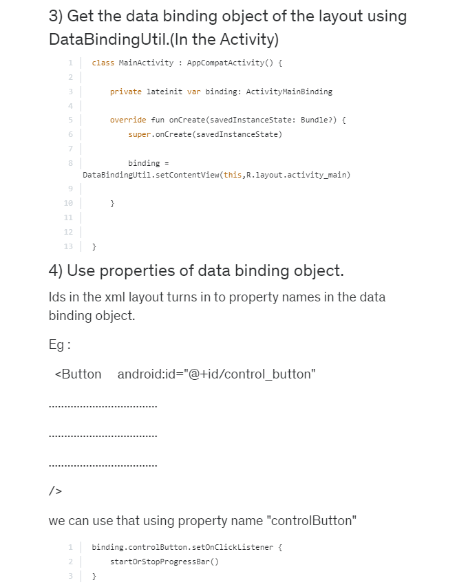
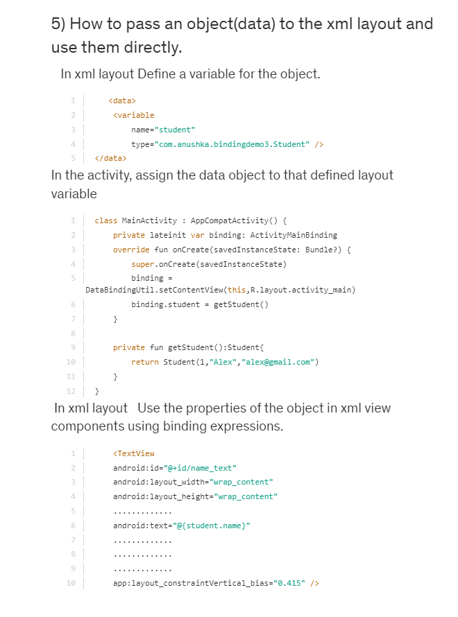

# android 스터디

---
### 코틀린 클래스 생성: 상속, 주입 디자인 패턴
객체지향 개발에 최적화된 다양한 디자인 패턴이 고안됨. 일반적으로 객체간의 상속을 활용하여 모듈의 재사용성을 높이나, 경우에 따라선 강한 상속이 해가 되기도 한다. 이러한 경우 내/외부의 상속을 따르는 것이 아닌, 주입을 통해 클래스를 구현. 이러한 디자인 패턴에 대해: https://offbyone.tistory.com/402 참조

```
class myClass @Inject constructor(
    ...
) : motherClass<T1,T2>(myFunc(input)){
    private val myVal;
    private var myVar;
    
    init{
        ...
    }

    private fun{
        ...
    }
}
```

위와 같은 구조의 경우, 꽤나 복잡한 클래스 생성 중에 하나.
- 클래스명, 생성자(클래스 인자), 상속클래스, 초기화 블럭 
- @Inject 패턴이 들어가면 constructor 명시

#### 상속 가능한 클래스 
- `open` : 코틀린에서는, 상속이 가능하게 클래스를 디자인하려면 반드시 해당 키워드 붙여야. 또한 상속 클래스 내에서도 `override` 를 하기 위해서 `open fun` 처럼 `open` 키워드 붙여야.


### 상태 및 이벤트 효과적으로 다루기 state event
viewmodel viewstate
  
이벤트 트리거 해서 로딩상태로 진입, 조건에 따라 erorr 및 success 상태. success 상태에서는 refresh listening 하고, refresh 시에 다시 loading으로.  

#### LiveData
data 변경을 감시하는 data holder 클래스. 항시 data 에 대해 listening 하고 있다. 이러한 observable 이지만, 특수하게 안드로이드 생명주기 또한 알고 있다. 즉, 액티비티, 프래그먼트, 서비스 등의 안드로이드 컴포넌트의 생명주기를 인식하여 활성(live)시에만 데이터를 업데이트. 죽은 컴포넌트에서는 데이터 감지를 안하겠다는 뜻.
  - LiveData가 Observer 패턴을 따르므로, 생켱주기중 데이터 변경시 Observer 객체에 전달.
  - 메모리 누수 없음. 생명주기와 연결되어있으므로 NPE 발생 없음
  - 생명주기를 따라가기 때문에 stop 액티비티와 충돌 x
  - 자원 공유 가능. LiveData 상송하여 커스텀 클래스 생성 및 싱글톤 패턴으로 시스템 서비스를 wrapping 하여 앱 전역 자원 공유
- 아래와 같이 viewmodel 클래스 생성하고, 속성으로 LiveData 생성. 생성된 LiveData 는 컴포넌트의 onCreate 메소드에 위치 적합
  - 최초 실행되는 onCreate 말고 onResume 등에 위치 시, 중복호출의 가능성. 이러한 경우 생명주기 대한 추가적 handling 필요.
  ```
  class TestLiveDataViewModel : ViewModel() {
      // String 타입의 MutableLiveData 생성, by lazy로 초기화는 뒤에
      val textValue: MutableLiveData<String> by lazy {
          MutableLiveData<String>()
      }
  }
  ```
  ```
  class MainActivity : AppCompatActivity() {
    // 전역 변수로 ViewModel lateinit 세팅
    private lateinit var model: TestLiveDataViewModel
 
    override fun onCreate(savedInstanceState: Bundle?) {
        super.onCreate(savedInstanceState)
 
        // ViewModel을 가져옵니다.
        model = ViewModelProvider(this).get(TestLiveDataViewModel::class.java)
 
        // Observer를 생성한 뒤 UI에 업데이트 시켜 줍니다.
        val testObserver = Observer<String> { textValue ->
            // 현재 MainActivity에는 TextView가 하나만 존재합니다.
            // 다른 데이터를 받는 UI 컴포넌트가 있다면 같이 세팅 해줍니다.
            tv_livedata_test.text = textValue
        }
 
        // LiveData를 Observer를 이용해 관찰하고
        // 현재 Activity 및 Observer를 LifecycleOwner로 전달합니다.
        model.textValue.observe(this, testObserver)
    }
  }
  ```
https://lucky516.tistory.com/65 더 직관적인 예제


#### LiveData & MutableLiveData

---

### 변수,상수 생성 시점
코틀린에서는 변수 생성 시에 반드시 값이 초기화되어야 하는 구조이다.
클래스 내부에서 속성 변수를 생성하는 경우, 예를 들면:
```
class MyClass(){
    private var myString="Hello world"
}
```
같은 식으로 반드시 초기화가 되어야 한다. 위 같은 구조의 경우 `MyClass` 생성 시에 `myInt` 도 함께 생성된다. 따라서 `MyClass` 객체들은 모두 생성 시점에 동일한 값이 설정된다.  
하지만, 필요에 따라 생성시점을 변주할 경우가 생긴다. 이는 특히 상속 및 여러 개체에 변주를 줄 때 필요한 항목이다.
#### lateinit
```
class MyClass(){
    lateinit var myString: string
    if(...){
        myString="hello world"
    }
    if(myString.isinitialized) println(myString)
}
```
위의 경우 `lateinit` 키워드를 추가하여 `myInt` 의 생성시점을 조건 만족 시에 초기화하는 디자인이다. 다만, `lateinit` 의 경우: `string` 과 같이 `non-primitive` 타입만 지원한다. 즉, 반드시 초기화될 것을 기대한다. 따라서 초기화를 안해주고 변수 호출시 에러 발생.

#### lazy
`lzay` 는 `lateinit` 과 다르게 `var` 이 아닌 `val` 을 지원하여, 초기화 이후에는 변하지 않는 특성이다.
```
fun main() {
    lateinit var text: String
    val textLength: Int by lazy {
        text.length
    }

    // 대충 중간에 뭔가 했음
    text = "H43RO_Velog"
    println(textLength)
}
```
이처럼 `lazy` 디자인 패턴은 의존성이 묶여, 의존성이 해결된 시점에 해당 값이 초기화된다. 즉, 실제 필요시에만 값을 생성한다는 점에서 메모리에서 이득을 얻을 수 있다.

---

### MVC(Model View Controller) 아키텍처

  

- 모델: 데이터와 비즈니스 로직을 관리(`Americano.kt ... TotalPrice.kt`)
  - 앱이 포함해야하는 데이터, 상태, 비즈니스 로직 포함. 상태는 UI 의 상태(on/off). 비즈니스 로직은 데이터를 처리하는 알고리즘. 
- 뷰: 레이아웃과 화면을 처리(`activity_order.xml`)
  - 사용자에게 보이는 화면. 로직을 포함할 수 없으며, 동작처리 불가
- 컨트롤러: 모델과 뷰로 명령 전달(`OrderActivity.kt`)
  - 모델과 뷰의 가교 역할. 뷰에서 입력을 받으면, 모델로 전달하고 로직을 통해 변경된 데이터를 뷰에 전달. 안드로이드는 뷰(xml)와 컨트롤러(activity, fragment)를 묶어서 뷰로 상정하므로, 이러한 역할이 잘 드러나지는 않음.

https://github.com/MyStoryG/Android_MVC_Example 예제 참조

> 👀 *다만 MVC 아키텍처의 경우,* 
> - activity 생명주기 변경시, activity 내부의 view, controller 영향이 커지고 이는 프로젝트가 커질수록 증폭
> - View, Controller 모두 ACtivity 에 종속됨.
> - 따라서 하나의 디자인에 종속된 여러 controller, view, model 모두 동반하여 수정해야함


### MVVM
View 의 상태를 보는 ViewModel 등장으로 View 와 ViewModel 간의 완전한 분리 가능. 뷰와 모델의 관심사를 완전히 분리하고, 뷰가 변경되더라도, 뷰모델에 데이터를 기억하여 값을 유지하는 아키텍처. 즉, 필요시에만 요청/호출이 가능. 뷰는 **보여주기만!** 뷰모델은 **데이터만!** https://velog.io/@kipsong/iOSDesignPattern-MVVM-%EA%B3%BC-DataBinding%EC%97%90-%EB%8C%80%ED%95%9C-%EA%B0%84%EB%9E%B5%ED%95%9C-%EC%86%8C%EA%B0%9C  

뷰모델은 액티비티 생성 시점에 메모리도 함꼐 할당되므로 데이터 기억이 가능하고, 하나의 뷰모델에 여러 뷰가 종속되기도 한다. 액티비티가 죽을 때 메모리가 방출.

  


1. 뷰: 이벤트를 발생하여 데이터 요청
2. 뷰모델: 해당 데이터를 로드하는 메서드 호출
3. 모델: 뷰모델의 요청값 반환
4. 뷰모델: 모델에서 받은 데이터를 `LiveData` 에 저장
5. 뷰: `LiveData` 감지하여 뷰에 출력

---

### View Binding 

기존에는 `findViewById()` 를 사용하여 데이터를 로드했으나, 해당 방식은 View 하위의 ViewGroup에 해당한 모든 View 와 ViewGroup 을 순회하여 일치하는 ID 를 조회하여 데이터를 로드하기 때문에 상당히,, 무거운 로직이다(`findViewTraversal`). https://velog.io/@dev_dejavu/android-View-binding%EA%B3%BC-Data-binding-%EB%B9%84%EA%B5%90 참조  

또한, null 을 반환하고 아무런 noti 가 없으므로 디버깅에 난이도를 높인다. 특히 xml 을 분리하여 리소스를 정의한 경우에도, 리소스 참조가 어디에서나 가능하다는 점으로,, 컴파일 에러가 안난다. 즉, 빌드는 완료되었으나, `logcat`에서 crash...

따라서 `View Binding` 

- 객체가 생성되므로 traversal 이 없다
- 코드가 간결해진다. 가독성, 유지보수성
- 그러나, 바인딩이 의존성을 줄여준다거나 느슨하게 한다던가 그런 건 아님.

### Data binding

뷰 바인딩과 마찬가지로, 데이터도 뷰모델에 유지하여 관리하는데, 데이터도 바인딩하는 개념이 데이터 바인딩. 특히, configuration changes: 가로-세로 화면 변경등 뷰가 onDestroy 되는 시점에 데이터도 함께 소멸되는데, 데이터 바인딩을 하면 데이터를 뷰모델에 유지시켜 다시 로드할 수 있음.

* configuration changes 예시: 
screen rotations, keyboard changes, language changes, enableing multi windows

이러한 configuration change 시에 리소스를 사용량을 축소하여 개발하는 것이 중요 고려 사항. 뷰가 destroy 될 때마다 모든 것을 처음부터 다시 해야 하기 때문,,,

#### Data Binding 사용법

1. build.gradle 수정
    ```
    android {
       ..........
       ..........
       ..........
        dataBinding{
            enabled true
        }
    }
    ```
2. .xml 에 `<layout></layout>` 태그 추가
   ```
   <?xml version="1.0" encoding="utf-8"?>
    <layout xmlns:android="http://schemas.android.com/apk/res/android"
        xmlns:app="http://schemas.android.com/apk/res-auto"
        xmlns:tools="http://schemas.android.com/tools">
        <androidx.constraintlayout.widget.ConstraintLayout
            android:layout_width="match_parent"
            android:layout_height="match_parent"
            tools:context=".MainActivity">
            ..............................................
            ..............................................
            ..............................................
            ..............................................
        </androidx.constraintlayout.widget.ConstraintLayout>
    </layout>
   ```


  


  


  

---

### ViewModel 생성과 ViewModelFactory

ViewModel 을 생성하기 위해서는 Kotlin Class 로 생성해야함. binding 객체 생성과 마찬가지로, `private lateinit var` 으로 생성하고 특정 메서드를 통해 생성 및 할당한다. ViewModel 의 메서드에는 데이터를 저장 및 유지보수하기 위한 함수들이 세팅된다. 이러한 함수를 MainActivity 에서 호출할 수 있도록 MainActivitiy 영역에서 생성한 것.  

다만, ViewModel 은 스스로는 초기화 세팅을 할 수 없으며 기본적인 초기화만 지원한다. 만약, 초기화에 특정한 옵션을 주고 싶다면, ViewModelProvider.Factory 클래스를 생성하여 초기값을 주거나, 변수전달이 가능하다.